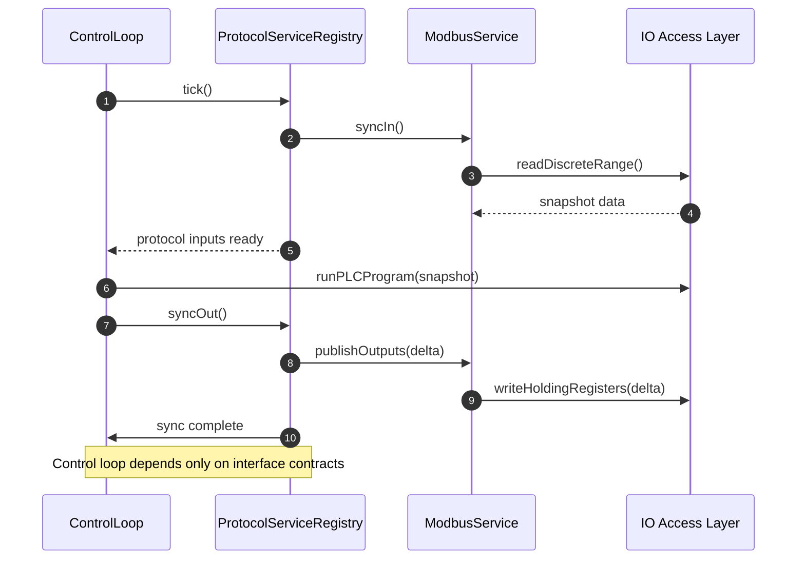

# OpenPLC v3 Runtime Codebase Summary

## Repository Layout
- `OpenPLC_v3/`: Python web UI plus native runtime sources. The runtime lives in `webserver/core/`, compiled into the `openplc` executable that the UI launches.
- `OpenPLC_v3/webserver/`: Flask app (`webserver.py`) with runtime control helpers (`openplc.py`, `monitoring.py`) and deployment scripts.
- `OpenPLC_v3/webserver/core/`: Control loop, protocol stacks, hardware abstractions, and generated glue (`debug.cpp`, `glueVars.cpp` generated during compilation).
- `OpenPLC_v3/webserver/core/hardware_layers/`: Board‑specific implementations of `initializeHardware()/updateBuffers*()`; the active file is chosen at build time.
- `OpenPLC_v3/utils/`: Third‑party protocol sources (Snap7, EtherCAT) copied into `core/` during build (`scripts/compile_program.sh`).
- `libmodbus_*`, `libmodbus_src/`: Upstream protocol code mirrored locally for building or reference.

## Core Runtime (`webserver/core`)
- `main.cpp` runs the PLC cycle. It boots the interactive server, hardware layer, Modbus master, persistent storage, and Snap7 runtime before entering the deterministic loop (`webserver/core/main.cpp:83`). The loop repeatedly `glueVars()`, updates hardware IO, locks `bufferLock`, invokes protocol hooks (`updateBuffersIn_MB()/Out_MB()`), executes the IEC program, and unlocks (`webserver/core/main.cpp:167-236`).
- `ladder.h` exposes the shared IO tables as global pointer grids (`bool_input`, `int_output`, etc.) that every module manipulates directly (`webserver/core/ladder.h:60-160`). These are populated by the auto‑generated `glueVars.cpp` produced when a PLC program is compiled.
- `utils.cpp` owns timing, logging, and lifecycle helpers (real‑time sleep, log buffer, interactive server bootstrap) and global state such as the Raspberry Pi RTS pin for Modbus RTU (`webserver/core/utils.cpp:32-127`).
- `hardware_layers/*.cpp` provide concrete `initializeHardware()/updateBuffersIn()/updateBuffersOut()` implementations for each supported board (`webserver/core/hardware_layers/raspberrypi.cpp:68` etc.). Selection is compile‑time.

## Protocol Services
### Modbus TCP/RTU Server (slave)
- `server.cpp` hosts both Modbus and EtherNet/IP listeners. It creates a thread per client and dispatches to `processModbusMessage()` while guarding shutdown with `run_modbus` (`webserver/core/server.cpp:210-315`).
- `modbus.cpp` parses Modbus/TCP frames manually and reads/writes the `ladder.h` buffers. `mapUnusedIO()` binds unassigned IEC variables to internal Modbus arrays so they always have backing storage (`webserver/core/modbus.cpp:120-159`). Function handlers build responses directly against the ADU buffers.

### Modbus Master (client)
- `modbus_master.cpp` reads `mbconfig.cfg`, instantiates libmodbus TCP/RTU contexts, and spawns `querySlaveDevices()` to poll/write slaves (`webserver/core/modbus_master.cpp:614-686`).
- The polling thread copies data between the libmodbus buffers and the shared IO arrays inside `updateBuffersIn_MB()/updateBuffersOut_MB()` (`webserver/core/modbus_master.cpp:693-719`), guarded by `ioLock` plus the main loop’s `bufferLock`.

### DNP3 Outstation
- `dnp3.cpp` wraps `asiodnp3`, building an outstation with `CommandCallback` to translate control writes into IEC memory (`webserver/core/dnp3.cpp:204-257`).
- `dnp3StartServer()` enables the channel, reuses `mapUnusedIO()`, and in its service loop locks `bufferLock`, pushes new values to the outstation, then sleeps on the PLC tick (`webserver/core/dnp3.cpp:422-459`).

### EtherNet/IP + PCCC
- `enip.cpp` implements EtherNet/IP message parsing by hand, delegating PCCC payloads to `pccc.cpp`. It shares the same socket infrastructure as Modbus through `startServer()` (`webserver/core/enip.cpp:1-160`, `webserver/core/server.cpp:271-315`).

### Snap7 Server
- Snap7 bindings live under `utils/snap7_src/wrapper/oplc_snap7.cpp`, copied into `core/` during compilation (`webserver/scripts/compile_program.sh:34-41`).
- `initializeSnap7()/startSnap7()/stopSnap7()` are called from both `main.cpp` and the interactive server (`webserver/core/main.cpp:121-125`, `webserver/core/interactive_server.cpp:327-358`).

## Web Orchestration & Runtime Control
- `webserver/webserver.py` reads settings from `openplc.db` and issues runtime commands over a localhost socket to the interactive server (`webserver/webserver.py:22-83`).
- `openplc.py` spawns the `./core/openplc` process, proxies console output, and exposes methods (`start_modbus`, `start_dnp3`, etc.) that send formatted strings to the interactive server (`webserver/openplc.py:56-158`).
- `interactive_server.cpp` listens on port 43628, toggling `run_modbus`, `run_dnp3`, `run_enip`, `run_snap7`, and launching or joining the corresponding pthreads (`webserver/core/interactive_server.cpp:43-360`). This is the control point where protocol lifecycles couple tightly to the core runtime.

## Shared Data Flow
- All protocols and the IEC program share the same pointer grids from `ladder.h`, guarded by `bufferLock`. There is no abstraction boundary; modules read/write the arrays directly, balancing correctness on discipline.
- `mapUnusedIO()` (Modbus) and the DNP3 server repurpose unused IEC addresses to ensure each protocol always has space to mirror data.
- The main loop invokes protocol buffer syncs inline (`updateBuffersIn_MB()/Out_MB()`), so the control cycle depends on protocol code being linked even when a protocol is disabled at runtime.

## Modularization Considerations
- **Define a protocol service interface.** Extract the common lifecycle (init, attach, poll, shutdown) currently hard‑coded in `main.cpp` and `interactive_server.cpp` into an abstract interface. A registry could let `main.cpp` iterate enabled services without direct `initializeMB()`/`updateBuffersIn_MB()` calls.
- **Encapsulate shared IO access.** Replace direct use of the global pointer grids with an accessor API (e.g., `IoBus::readDiscrete(index)`). Protocol modules would depend on the API, allowing the core to change storage or synchronization without touching parser code.
- **Separate process/thread management.** `interactive_server.cpp` launches pthreads per protocol using globals. Moving this into protocol modules (or a service manager) would let each parser own its worker thread and synchronization primitives, easing substitution with external libraries.
- **Decouple protocol enablement from build.** Today the main loop links every protocol, even if disabled. Turning each protocol into a loadable module (shared library or compiled component behind an interface) would keep the control loop focused on scheduling and IO exchange.
- **Centralize configuration.** Modbus master parses `mbconfig.cfg` inside its module, while other protocols rely on defaults/constants. A configuration service that constructs protocol instances would make future protocol additions uniform and testable.
- **Clarify generated artifacts.** Document the lifecycle for `glueVars.cpp` and ensure build tooling copies third‑party wrappers (Snap7, EtherCAT) in a predictable step, so protocol modules can be compiled independently.

## Quick Wins Toward Separation
- Introduce a lightweight `ProtocolService` struct (`name`, `start()`, `stop()`, `syncIn()`, `syncOut()`) and adapt Modbus master first, reducing special‑case code in `main.cpp` and `interactive_server.cpp`.
- Wrap the shared buffers with thin getters/setters and update Modbus/DNP3 to use them, proving the abstraction before touching other protocols.
- Move `mapUnusedIO()` style binding logic behind a factory so protocols request address ranges instead of mutating the global arrays directly.

## Sequence Diagrams

### Existing Coupled Flow
```mermaid
sequenceDiagram
    autonumber
    participant MainLoop as main.cpp
    participant ModbusMaster as modbus_master.cpp
    participant Buffers as ladder.h globals
    participant ModbusServer as server.cpp/modbus.cpp

    MainLoop->>Buffers: updateBuffersIn()
    MainLoop->>ModbusMaster: updateBuffersIn_MB()
    ModbusMaster->>Buffers: copy bool/int inputs
    MainLoop->>Buffers: lock bufferLock
    MainLoop->>ModbusMaster: config_run__ executes logic using shared globals
    MainLoop-->>Buffers: unlock bufferLock
    MainLoop->>ModbusMaster: updateBuffersOut_MB()
    ModbusMaster->>Buffers: copy bool/int outputs
    MainLoop->>Buffers: updateBuffersOut()
    note over Buffers: Global arrays modified in-place
    ModbusServer->>Buffers: read/write during request handling
    Buffers-->>ModbusServer: live IO pointers; no mediation
```

### Proposed Isolated Flow


### Message Passing Changes
- Introduce `ProtocolServiceRegistry` to own protocol lifecycles and schedule `syncIn/syncOut` per tick instead of hard-coding calls in `main.cpp`.
- Provide an `IoBus` facade returning snapshots/deltas so services no longer touch shared globals directly.
- Modbus server/client implementations consume the facade inside their threads or polling loops, while the control loop interacts only with the registry.
